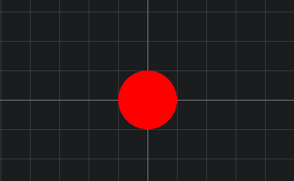
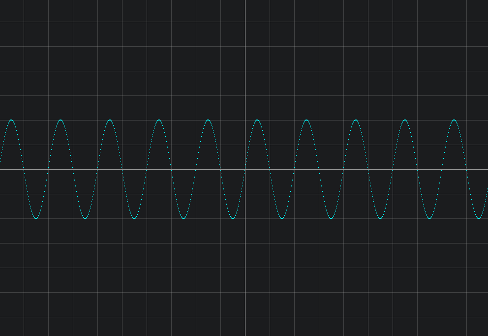

shader也称`着色器`.着色器分为`顶点着色器`和`片元着色器`.


## 第一个程序

示例：  
html布局如下：  

```html
<div class="grid">
	<canvas id="app" width="1000" height="700"></canvas>
	<div class="xaxis"></div>
	<div class="yaxis"></div>
</div>
```
```js
const el = document.getElementById("app")
const gl = el.getContext("webgl")
// 创建顶点着色器
var vertexShader = gl.createShader(gl.VERTEX_SHADER);
gl.shaderSource(vertexShader, `
    precision mediump float;
    attribute vec2 a_Position;
    void main(){
        gl_Position = vec4(a_Position,0.0, 1.0);
    }
`);
gl.compileShader(vertexShader);

// 创建片元着色器
var fragmentShader = gl.createShader(gl.FRAGMENT_SHADER);
gl.shaderSource(fragmentShader, `
    precision mediump float;      
    void main(){
        if(gl_FragCoord.x>500.0){
            gl_FragColor = vec4(1.0,0.0,0.0,1.0);
        }else{
            gl_FragColor = vec4(0.0,1.0,0.0,1.0);
        }
        
    }
`);
gl.compileShader(fragmentShader);
// 创建程序
var program = gl.createProgram();
//将顶点着色器挂载在着色器程序上。
gl.attachShader(program, vertexShader); 
//将片元着色器挂载在着色器程序上。
gl.attachShader(program, fragmentShader);
//链接着色器程序
gl.linkProgram(program);
gl.useProgram(program);

const buffer = gl.createBuffer()
// 通过类型化数组来传递数据给webgl
const data = new Float32Array([
    -1.0,1.0,
    -1.0,-1.0,
    1.0,-1.0,
])
gl.bindBuffer(gl.ARRAY_BUFFER,buffer)
gl.bufferData(gl.ARRAY_BUFFER,data,gl.STATIC_DRAW)
const a_position_pointer = gl.getAttribLocation(program,'a_Position')
gl.vertexAttribPointer(a_position_pointer,2,gl.FLOAT,false,8,0)
gl.enableVertexAttribArray(a_position_pointer)
// 绘制三角形
gl.drawArrays(gl.TRIANGLES,0,3)
```
效果如图所示：


## 基础语法
程序开始执行的入口

## 变量

## 宏

## 常用函数

## length

## distance


## dot
dot 函数返回向量的点积。


## step 
step 函数传入两个参数，step(x,y),当 y>=x 时，返回1.0，否则返回 0.0，注意返回值类型为浮点数。  
下面使用step函数画一个半径为 50 的圆。
```c
vec2 p = (gl_FragCoord.xy - vec2(500.0,350.0)) / 50.0;
float distanceSquared = dot(p, p);
if(step(distanceSquared,1.0) == 1.0){
    gl_FragColor = vec4(1.0, 0.0, 0.0, 1.0); // 红色
}else{
    discard;
}
```


如果没有step函数，也可以使用`比较`来实现
```c
if(distanceSquared<1.0){
    gl_FragColor = vec4(1.0, 0.0, 0.0, 1.0); // 红色
}else{
    discard;
}
```

## smoothstep
平滑过渡函数，smoothstep(a,b,x)


## mix 混合函数
mix(x,y,a) 用于在两个值之间进行线性混合，将会返回结果为 `x*(1-a) + y*a`。在函数的参数中，x 和 y 是要进行混合的两个值，a 是混合因子，表示在 x 和 y 之间混合的程度。a 通常应该在 0 到 1 之间。也可以传入向量进行混合，例如实现红色和绿色


## sin(x)
正弦函数，x为弧度制，例如180度，则需要传入 sin(3.1415),注意shader语言中并没有内置一个像js中 `PI`常量,需要开发者自己定义。
```c
	precision mediump float;
    void main(){
        const float PI = 3.1415;
        float t = (2.0*PI)/100.0;
        float x = gl_FragCoord.x;
        float y = 100.0*sin(t*(x-500.0))+350.0;
        float PosY = float(gl_FragCoord.y);	
        if(abs(PosY - y)<=1.0){
            gl_FragColor = vec4(0.0, 1.0, 1.0, 1.0);
        }else{
            discard;
        }
    }
```


## cos(x)
余弦函数，使用方法同sin(x)


